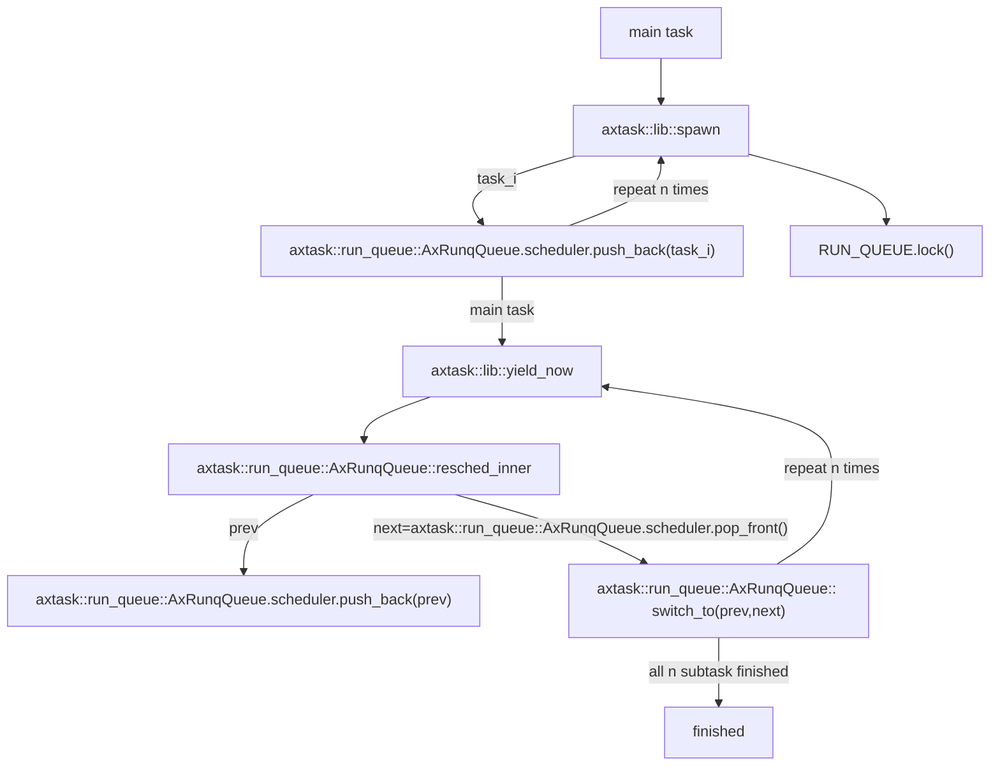

## 多任务调度应用

在前面两节中，我们介绍了多任务调度中最关键的 module 和 crate 的实现，下面我们以一些应用为例，初步了解实现支持多任务调度的 Unikernel 是如何构建起来的。

### yield：多任务创建与切换


```rust
fn main() {
    for i in 0..NUM_TASKS {
        task::spawn(move || {
            println!("Hello, task {}! id = {:?}", i, task::current().id());
            // 此时已经启动了yield
            // preempt所需要的依赖libax/sched_rr并没有被包含进去,所以这里默认为协作式实现
            #[cfg(not(feature = "preempt"))]
            task::yield_now();

            let order = FINISHED_TASKS.fetch_add(1, Ordering::Relaxed);
            if option_env!("SMP") == Some("1") {
                assert!(order == i); // FIFO scheduler
            }
        });
    }
    println!("Hello, main task{}!");
    while FINISHED_TASKS.load(Ordering::Relaxed) < NUM_TASKS {
        #[cfg(not(feature = "preempt"))]
        task::yield_now();
    }
    println!("Task yielding tests run OK!");
}
```
这是一个利用fifo算法进行线程管理的示例程序。从代码实现细节来看，主要分成两步实现：

1. 操作系统初始化，加载 yield 应用。
2. 使用 `task::spawn` 循环来生成 `NUM_TASKS` 任务（类似于线程）。
每个任务执行一个函数，只需打印其ID即可。
如果禁用抢占，也就是应用协作式方法，任务会自动执行 `yield` 以放弃CPU。如果不使能SMP，使用单核编译，任务的执行顺序必须是`FIFO`。
`main task` 将等待所有其他任务完成。如果没有，则继续执行 `yield` 并等待。

也就是说我们如果不规定APP_FEATURE内参数为抢占，那么将默认采取协作式进行实现。读者可以通过运行以下命令进行测试：
```bash
make A=apps/task/yield ARCH=riscv64 LOG=info SMP=1 run
```

启动yield的同时，我们实现了更加细节部分的调用，流程图如下：

注意到，我们在实现支持多任务调度的 Unikernel 时，需要在统一的接口实现内存分配的算法，包括了 `alloc` 和 `paging`，内存管理的具体内容我们放在下一章介绍。

### parallel：多核并行计算

```rust
#[cfg(feature = "axstd")]
fn barrier() {
    use std::sync::atomic::{AtomicUsize, Ordering};
    static BARRIER_WQ: AxWaitQueueHandle = AxWaitQueueHandle::new();
    static BARRIER_COUNT: AtomicUsize = AtomicUsize::new(0);
    BARRIER_COUNT.fetch_add(1, Ordering::Relaxed);
    api::ax_wait_queue_wait(
        &BARRIER_WQ,
        || BARRIER_COUNT.load(Ordering::Relaxed) == NUM_TASKS,
        None,
    );
    api::ax_wait_queue_wake(&BARRIER_WQ, u32::MAX); // wakeup all
}
for i in 0..NUM_TASKS {
    let vec = vec.clone();
    tasks.push(thread::spawn(move || {
        let left = i * (NUM_DATA / NUM_TASKS);
        let right = (left + (NUM_DATA / NUM_TASKS)).min(NUM_DATA);
        let partial_sum: u64 = vec[left..right].iter().map(sqrt).sum();
        barrier();
        partial_sum
    }));
}
```

`parallel` 对数组中每个元素求 `sqrt` 再求和。

首先看 `main` 函数的执行流程：

- 接口 `api::ax_wait_queue_wait` 阻塞当前线程直到条件满足或超时，此处调用该接口等于主线程睡眠 500ms 。
- 调用 `task::spawn` 创建 `NUM_TASKS` 个线程，每个线程负责对全局数据的一部分的每个元素执行 `sqrt` 计算。
- 调用 `barrier` 等待所有线程完成计算任务并返回结果（`barrier` 函数阻塞线程直到所有线程都执行到调用该函数的位置）
- 将所有线程的结果累加得到最终结果
