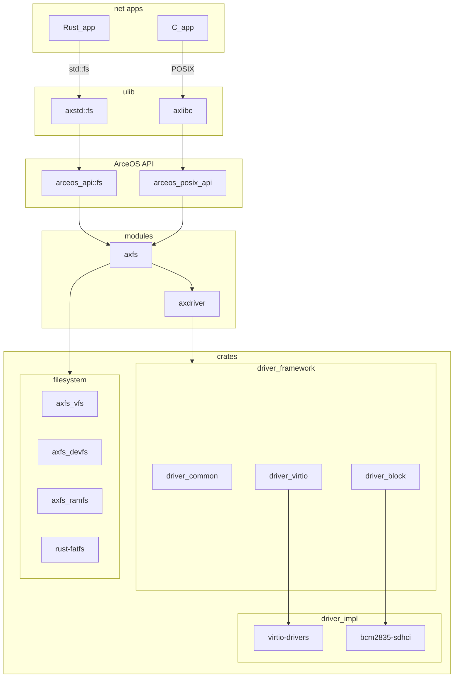

# 文件系统的框架设计

ArceOS 中与文件系统相关的 crates 和 modules 如下：

- crates
  - axfs_devfs: 设备文件系统；
  - axfs_ramfs: 内存文件系统；
  - axfs_vfs: 虚拟文件系统，定义了对文件系统和文件结点的操作，为不同的文件系统提供统一的接口；
  - driver_common: 不同设备驱动通用的接口定义；
  - driver_block: 块设备驱动，定义了块设备特定的接口，并实现了内存模拟硬盘 (ramdisk) 和树莓派的 SD 卡控制器 (bcm2835sdhci) 驱动；
  - driver_virtio: `virtio` 驱动，其中包含 `virtio-blk` 块设备驱动封装，实现了 `driver_block` 中定义的块设备驱动接口
- modules
  - axdriver: ArceOS 的驱动框架；
  - axfs: ArceOS 文件系统框架，整合了驱动、VFS 和应用接口，提供内核文件和磁盘对象，支持文件、路径、挂载等操作；
- arceos_api/arceos_posix_api: ArceOS API

它们的依赖关系如下：

