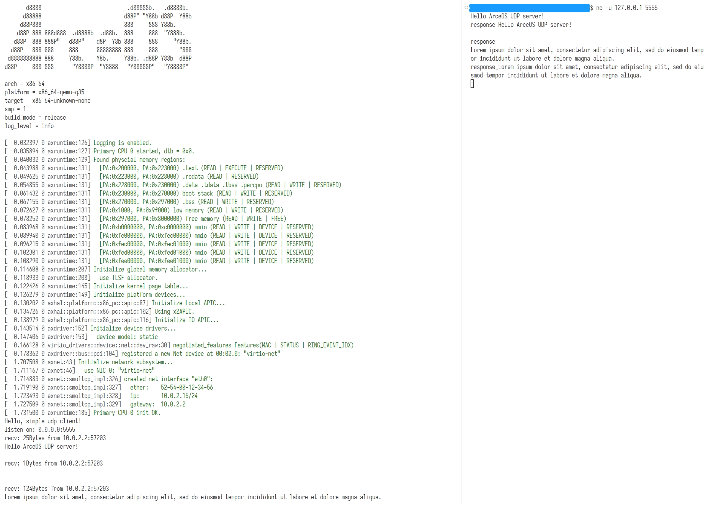

# 设计实现支持网络的 unikernel

到目前为止，我们的操作系统已经能够存储和处理数据，但是在传输方面的能力还很弱。
本章我们将研究如何将系统接入计算机网络，使其能够与其他计算机高效地通信。

与先前介绍的其他组件不同，网络有较为成熟的模型、协议和接口规范。
以接收网络数据的过程为例，根据网络的分层模型，网卡负责将物理层的信号转换为链路层帧交给软件，
软件将链路层的帧按照链路层、网络层和传输层的协议栈（例如 TCP/IP）解析处理，将其中的数据再传递给应用
（将协议栈甚至应用卸载到网卡硬件实现的设计不在本文讨论范围之内）。
这一过程中，操作系统需要通过驱动配置网卡并与网卡交换数据，实现协议栈，为应用提供编程模型和接口
（例如套接字 socket）——驱动、协议栈和应用接口正是让我们的 unikernel 支持网络所必需的三个组件。

## 动手尝试

在 ArceOS 中有多个支持网络的样例应用，位于 `apps/net` 路径中，其中较为简单的一个是 `udpserver` ，
它会监听 UDP 5555 端口，将收到的数据在终端打印出来，并在开头加上 `response_` 之后通过 UDP 回传：

```rust
#![cfg_attr(feature = "axstd", no_std)]
#![cfg_attr(feature = "axstd", no_main)]

#[macro_use]
#[cfg(feature = "axstd")]
extern crate axstd as std;

use std::io;
use std::net::{ToSocketAddrs, UdpSocket};

const LOCAL_IP: &str = "0.0.0.0";
const LOCAL_PORT: u16 = 5555;

fn receive_loop() -> io::Result<()> {
    let addr = (LOCAL_IP, LOCAL_PORT).to_socket_addrs()?.next().unwrap();
    let socket = UdpSocket::bind(addr)?;
    println!("listen on: {}", socket.local_addr().unwrap());
    let mut buf = [0u8; 1024];
    loop {
        match socket.recv_from(&mut buf) {
            Ok((size, addr)) => {
                println!("recv: {}Bytes from {}", size, addr);
                let mid = core::str::from_utf8(&buf).unwrap();
                println!("{}", mid);
                let mid = ["response_", mid].join("");
                socket.send_to(mid.as_bytes(), addr)?;
                buf = [0u8; 1024];
            }
            Err(e) => return Err(e),
        };
    }
}

#[cfg_attr(feature = "axstd", no_mangle)]
fn main() {
    println!("Hello, simple udp client!");
    receive_loop().expect("test udp client failed");
}
```

我们可以执行如下命令运行该应用：

```sh
make A=apps/net/echoserver NET=y LOG=info run
```

打开另一个终端，使用 `nc` 工具连接对应的 UDP 端口：

```sh
nc -u 127.0.0.1 5555
```

之后在该终端中输入一些内容，按回车发送，可以观察收到的回复和 `udpserver` 在终端的输出：


