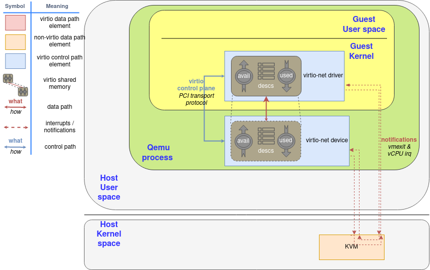

# 网络框架的功能需求

## 网络应用接口

回顾之前我们运行的 `udpserver` 样例应用：

```rust
#![cfg_attr(feature = "axstd", no_std)]

#[macro_use]
#[cfg(feature = "axstd")]
extern crate axstd as std;

use std::io;
use std::net::{ToSocketAddrs, UdpSocket};
```

初看起来似乎我们使用了 `std::net::UdpSocket` 等接口，但在启用了 `axstd` 特性的情况下，实际上使用的是 `ulib/axstd` 中的对应的接口。
在 ArceOS 中，对于 Rust 应用，我们尽量提供与 `std` 等标准库相同的原生接口，对于 C 应用则通过 `ulib/axlibc` 提供 POSIX 接口，以提高应用兼容性。

## 选择网络协议栈

计算机网络协议种类繁多，作为 unikernel ，我们在满足应用需求的基础上，尽可能保持系统组件精简；
另一方面，从组件化的角度出发，我们可以选择已有的较成熟的协议栈实现，减少重复开发工作。
结合这两点，我们选择了 [smoltcp](https://github.com/smoltcp-rs/smoltcp) 作为网络协议栈。
smoltcp 支持以太网, ARP/ND, IPv4/IPv6, ICMP/ICMPv6, TCP, UDP 等协议，可满足大部分应用的网络需求，在嵌入式和实时系统中得到广泛应用。
smoltcp 提供了所需的[网卡设备抽象接口](https://docs.rs/smoltcp/latest/smoltcp/phy/index.html)，我们在网卡驱动中实现该接口即可与协议栈整合：

```rust
pub trait Device {
    type RxToken<'a>: RxToken
       where Self: 'a;
    type TxToken<'a>: TxToken
       where Self: 'a;

    // Required methods
    fn receive(
        &mut self,
        timestamp: Instant
    ) -> Option<(Self::RxToken<'_>, Self::TxToken<'_>)>;
    fn transmit(&mut self, timestamp: Instant) -> Option<Self::TxToken<'_>>;
    fn capabilities(&self) -> DeviceCapabilities;
}

pub trait RxToken {
    // Required method
    fn consume<R, F>(self, f: F) -> R
       where F: FnOnce(&mut [u8]) -> R;

    // Provided method
    fn meta(&self) -> PacketMeta { ... }
}

pub trait TxToken {
    // Required method
    fn consume<R, F>(self, len: usize, f: F) -> R
       where F: FnOnce(&mut [u8]) -> R;

    // Provided method
    fn set_meta(&mut self, meta: PacketMeta) { ... }
}
```

`Device` 接口需要驱动实现接收、发送和查询设备功能的函数。
按照 smoltcp 的设计，接收和发送函数仅构造并返回对应的令牌 (`token`) ，直到令牌被消耗时才真正执行对应的接收和发送操作；

## 网卡的运行模式

常见的网卡通过 MMIO 或 PCI 等总线提供一组配置寄存器，通过一个或多个环形队列传递用于接收和发送数据的缓冲区描述符（包含地址、长度、编号等信息），数据平面由 DMA 访问对应的缓冲区传递数据。
这一 I/O 模式也不仅局限于网卡，在硬盘、显卡等设备上也很常见。

以 `virtio-net` 为例，下图是 `virtio-net` 的架构示意图：



我们的 unikernel 将运行在 Guest Kernel 的位置上。
`descs` 中存储了若干缓冲区描述符，`avail` 和 `used` 是两个环形队列，分别用于内核向设备提交可用的描述符，以及设备将使用过的描述符返回给内核。

## 网卡驱动的功能

仍然以 `virtio-net` 为例，网卡驱动发送数据包的典型过程如下：

1. 驱动构造缓冲区和描述符，存入 `desc` 表中；
2. 驱动将对应的缓冲区描述符写入 `avail` 队列；
3. 驱动通知设备有缓冲区可用；
4. 设备根据 `avail` 队列找到对应的缓冲区描述符，再根据描述符从内存中读取数据并发送（在图中“设备”由宿主机用户态的 Qemu 进程模拟）；
5. 设备将发送完成的描述符写入 `used` 队列；
6. 设备通知驱动发送完成；
7. 驱动从 `used` 队列中回收缓冲区。

接收过程与上述基本相同，区别在于此时设备向缓冲区中写入收到的数据，而非从中读取。
对于不同的网卡，队列的数量、描述符和命令的格式可能有区别
（例如有的按数组基址+偏移下标来指示缓冲区，有的直接传递地址指针，有的支持散布-收集 (scatter-gather) 的缓冲区），
但整体的操作逻辑大同小异。
除此之外，还有些与具体网卡相关的初始化、配置等操作，这一部分需要根据网卡的硬件手册实现。
