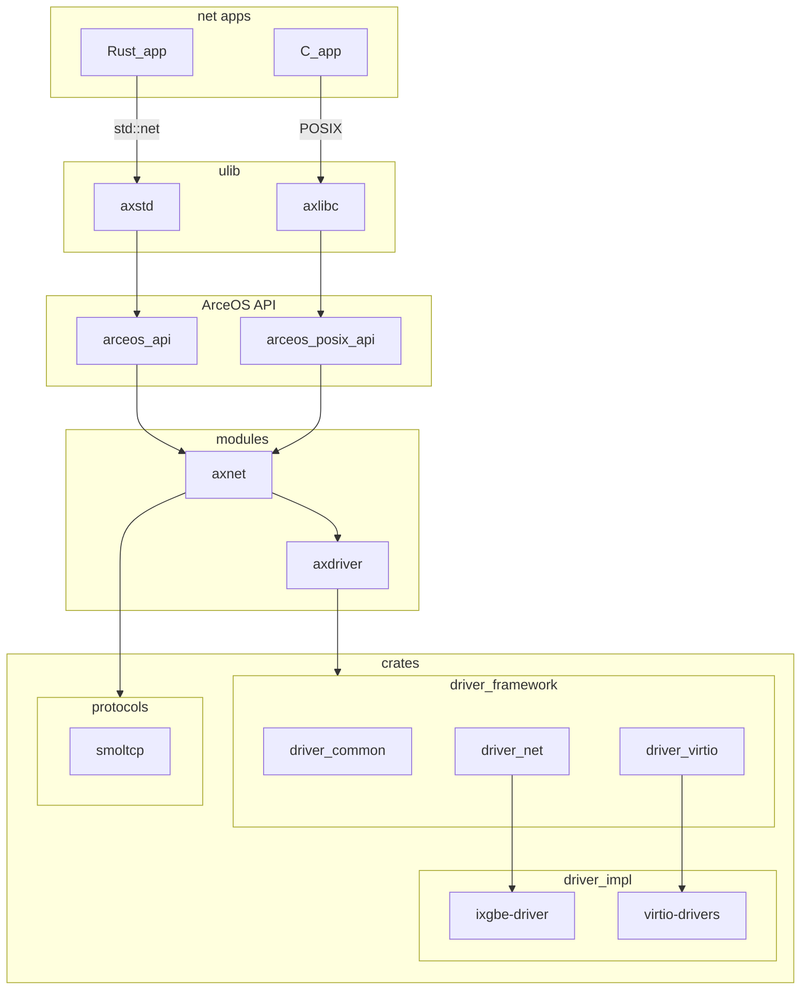

# 网络 unikernel 的框架设计

与网络相关的 crates 和 modules 如下：

- crates
  - driver_common: 不同设备驱动通用的接口定义；
  - driver_net: 网卡驱动，包含接口定义、一种网络包缓冲池的实现和对 Intel 10Gb 网卡驱动 (`ixgbe`) 的封装和 HAL 接口抽象；
  - driver_virtio: `virtio` 驱动，其中包含 `virtio-net` 网卡驱动封装，实现了 `driver_net` 中定义的网卡驱动接口
  - [ixgbe-driver](https://github.com/KuangjuX/ixgbe-driver): Intel 10Gb 网卡驱动的具体实现
  - [virtio-drivers](https://crates.io/crates/virtio-drivers): virtio 设备驱动的实现
  - [smoltcp](https://github.com/smoltcp-rs/smoltcp): 网络协议栈
- modules
  - axdriver: ArceOS 的驱动框架；
  - axnet: ArceOS 网络框架，整合驱动、协议栈和应用接口；
- arceos_api/arceos_posix_api: ArceOS API

它们的依赖关系如下：

