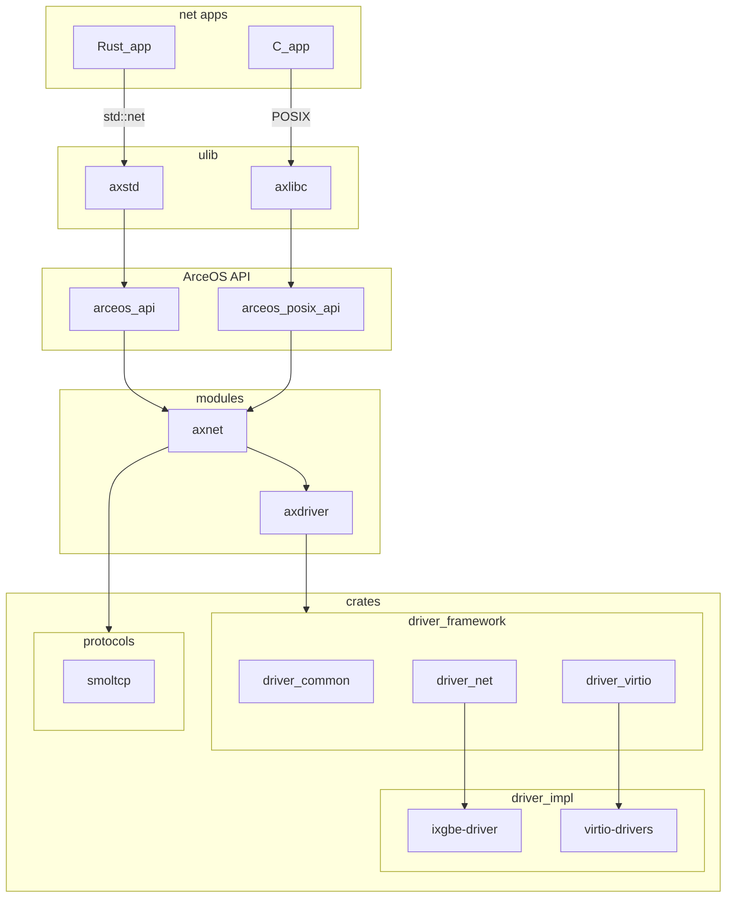

# 网络 unikernel 的框架设计

上一节中我们以 smoltcp 和 virtio-net 为例，介绍了应用接口、网络协议栈和网卡驱动的功能需求。
但作为一个组件化的操作系统，我们并不局限于仅支持一个协议栈或是一两种网卡，因此还需要通过合适的抽象和拆分，为不同的中间组件和应用提供统一的接口。

ArceOS 中与网络相关的 crates 和 modules 如下：

- crates
  - driver_common: 不同设备驱动通用的接口定义；
  - driver_net: 网卡驱动，包含接口定义、一种网络包缓冲池的实现和对 Intel 10Gb 网卡驱动 (`ixgbe`) 的封装和 HAL 接口抽象；
  - driver_virtio: `virtio` 驱动，其中包含 `virtio-net` 网卡驱动封装，实现了 `driver_net` 中定义的网卡驱动接口
  - [ixgbe-driver](https://github.com/KuangjuX/ixgbe-driver): Intel 10Gb 网卡驱动的具体实现
  - [virtio-drivers](https://crates.io/crates/virtio-drivers): virtio 设备驱动的实现
  - [smoltcp](https://github.com/smoltcp-rs/smoltcp): 网络协议栈
- modules
  - axdriver: ArceOS 的驱动框架；
  - axnet: ArceOS 网络框架，整合驱动、协议栈和应用接口；
- arceos_api/arceos_posix_api: ArceOS API

它们的依赖关系如下：



## 网络应用接口

为了提高兼容性和性能，ArceOS 提供了 Rust 原生接口 (`arceos_api`) 和 POSIX (`arceos_posix_api`) 两套 API ，
前者通过 `axstd` 转换为类 `std` 接口，后者则通过 `axlibc` 转换为类标准 C 库的接口。
对于网络部分，二者则统一基于 `axnet` module 提供的 `TcpSocket` 和 `UdpSocket` 封装实现，
这两个结构体又由 `axnet` 对协议栈 (smoltcp) 提供的类 Socket 接口封装而来。

以 `arceos_api` 为例，与网络相关的部分接口定义如下：

```rust
/// Networking primitives for TCP/UDP communication.
pub mod net {
    define_api_type! {
        @cfg "net";
        pub type AxTcpSocketHandle;
        pub type AxUdpSocketHandle;
    }

    define_api! {
        @cfg "net";
        // TCP socket

        /// Creates a new TCP socket.
        pub fn ax_tcp_socket() -> AxTcpSocketHandle;
        /// Returns the local address and port of the TCP socket.
        pub fn ax_tcp_socket_addr(socket: &AxTcpSocketHandle) -> AxResult<SocketAddr>;
        /// Returns the remote address and port of the TCP socket.
        pub fn ax_tcp_peer_addr(socket: &AxTcpSocketHandle) -> AxResult<SocketAddr>;
        /// Moves this TCP socket into or out of nonblocking mode.
        pub fn ax_tcp_set_nonblocking(socket: &AxTcpSocketHandle, nonblocking: bool) -> AxResult;

        /// Connects the TCP socket to the given address and port.
        pub fn ax_tcp_connect(handle: &AxTcpSocketHandle, addr: SocketAddr) -> AxResult;
        /// Binds the TCP socket to the given address and port.
        pub fn ax_tcp_bind(socket: &AxTcpSocketHandle, addr: SocketAddr) -> AxResult;
        /// Starts listening on the bound address and port.
        pub fn ax_tcp_listen(socket: &AxTcpSocketHandle, _backlog: usize) -> AxResult;
        /// Accepts a new connection on the TCP socket.
        ///
        /// This function will block the calling thread until a new TCP connection
        /// is established. When established, a new TCP socket is returned.
        pub fn ax_tcp_accept(socket: &AxTcpSocketHandle) -> AxResult<(AxTcpSocketHandle, SocketAddr)>;

        /// Transmits data in the given buffer on the TCP socket.
        pub fn ax_tcp_send(socket: &AxTcpSocketHandle, buf: &[u8]) -> AxResult<usize>;
        /// Receives data on the TCP socket, and stores it in the given buffer.
        /// On success, returns the number of bytes read.
        pub fn ax_tcp_recv(socket: &AxTcpSocketHandle, buf: &mut [u8]) -> AxResult<usize>;
        /// Returns whether the TCP socket is readable or writable.
        pub fn ax_tcp_poll(socket: &AxTcpSocketHandle) -> AxResult<AxPollState>;
        /// Closes the connection on the TCP socket.
        pub fn ax_tcp_shutdown(socket: &AxTcpSocketHandle) -> AxResult;

        ...
    }
}
```

其中 `define_api` 和 `define_api_type` 可以根据 `@cfg` 提供的特性名称，生成基于特性的条件编译代码。

## 网卡驱动框架

尽管 smoltcp 提供了 `Device` 设备抽象，但我们的驱动并不直接实现该接口。
在 ArceOS 中，网卡驱动的功能被抽象为一组 `NetDriverOps` 抽象接口，包含缓冲区管理和数据收发等操作。
这些接口定义在 `driver_net` crate 中，由 `axdriver` module 包装成 `AxNetDevice` 网络设备模型，再在 `axnet` module 中适配 smoltcp 的设备抽象接口。

```rust
/// Operations that require a network device (NIC) driver to implement.
pub trait NetDriverOps: BaseDriverOps {
    /// The ethernet address of the NIC.
    fn mac_address(&self) -> EthernetAddress;

    /// Whether can transmit packets.
    fn can_transmit(&self) -> bool;

    /// Whether can receive packets.
    fn can_receive(&self) -> bool;

    /// Size of the receive queue.
    fn rx_queue_size(&self) -> usize;

    /// Size of the transmit queue.
    fn tx_queue_size(&self) -> usize;

    /// Gives back the `rx_buf` to the receive queue for later receiving.
    ///
    /// `rx_buf` should be the same as the one returned by
    /// [`NetDriverOps::receive`].
    fn recycle_rx_buffer(&mut self, rx_buf: NetBufPtr) -> DevResult;

    /// Poll the transmit queue and gives back the buffers for previous transmiting.
    /// returns [`DevResult`].
    fn recycle_tx_buffers(&mut self) -> DevResult;

    /// Transmits a packet in the buffer to the network, without blocking,
    /// returns [`DevResult`].
    fn transmit(&mut self, tx_buf: NetBufPtr) -> DevResult;

    /// Receives a packet from the network and store it in the [`NetBuf`],
    /// returns the buffer.
    ///
    /// Before receiving, the driver should have already populated some buffers
    /// in the receive queue by [`NetDriverOps::recycle_rx_buffer`].
    ///
    /// If currently no incomming packets, returns an error with type
    /// [`DevError::Again`].
    fn receive(&mut self) -> DevResult<NetBufPtr>;

    /// Allocate a memory buffer of a specified size for network transmission,
    /// returns [`DevResult`]
    fn alloc_tx_buffer(&mut self, size: usize) -> DevResult<NetBufPtr>;
}
```
